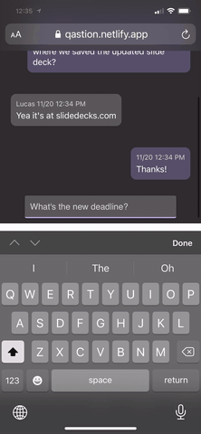

#  🧠 Qastion

[Live MVP DEMO](https://qastion.netlify.app)

Searchable, accesible tribal knowledge at your fingertips

## Functionality

Qastion integrates via a Microsoft Teams Plugin that extracts Questions and Answers from your organization's messages.

Information is indexed and added to an Natural Language Processing intellisense engine that can answer common questions before you even hit send

## APIs

We want to integrate with the Microsoft Graph API for MS Teams

🔑 Azure Text Analytics API for extracting keywords

🔍 Elastic on Azure for searching and analyzing messages 